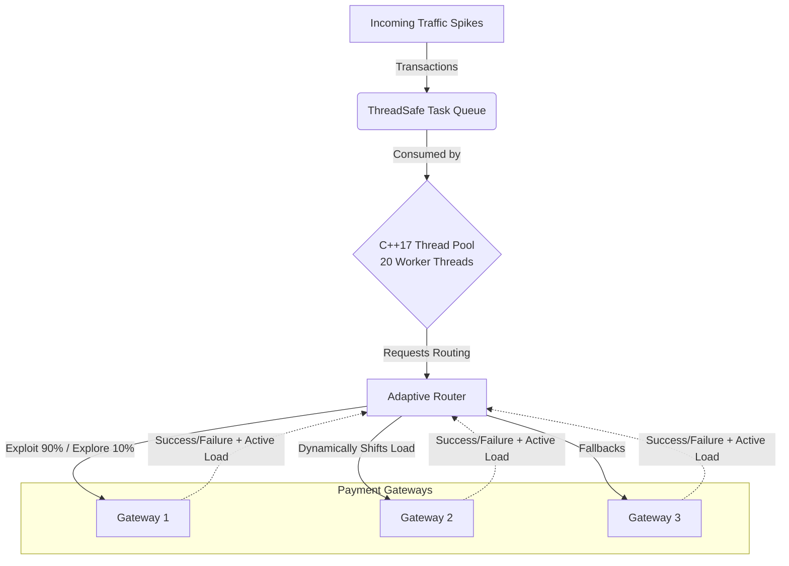

# PulseRoute: Adaptive Concurrent Payment Router

PulseRoute is a high-throughput, highly concurrent C++17 simulation of an Enterprise Payment Orchestration Engine (similar to the core routing engines used by Stripe, Razorpay, or Juspay). 

It demonstrates how modern fintech backends use **Adaptive Epsilon-Greedy Algorithms** and **Control-Theoretic Feedback Loops** to dynamically route credit card and UPI transactions away from failing bank infrastructure in real-time. This prevents cascading failures (The Thundering Herd problem) and maximizes transaction success rates.

## 🏗 Architecture & Flow



## ✨ Key Technical Features

1. **Epsilon-Greedy Routing**: Uses a 90/10 Exploit-Explore algorithm. 90% of the time, traffic is routed to the gateway with the highest historical success rate. 10% of the time, traffic is randomly distributed to explore network health and discover recovered gateways.
2. **Thundering Herd Mitigation**: To prevent the "best" gateway from being DDOSed by our own traffic, gateways track their active connections using lock-free `std::atomic<int>`. 
3. **Active Load Scoring**: The router calculates a dynamic score (`Historical Rate - (Penalty * Active Connections)`) to proactively balance load *before* a gateway reaches failure capacity.
4. **Massive Concurrency**: Uses C++17 `std::shared_mutex`. Hundreds of worker threads can read routing stats simultaneously using a `std::shared_lock` without blocking each other. The lock is only upgraded to an exclusive `std::unique_lock` for microseconds when a worker needs to update the historical stats.

## 🚀 How to Build & Run

PulseRoute uses CMake as its standard build system.

```bash
# 1. Generate the build files
cmake -S . -B build

# 2. Compile the project
cmake --build build

# 3. Run the stress test
./build/PulseRoute
```

*(Note: If you do not have CMake installed, you can compile it directly using `g++ -std=c++17 -Wall -Wextra -pthread -Iinclude src/main.cpp src/Gateway.cpp src/Router.cpp src/ThreadPool.cpp -o PulseRoute`)*

## 📊 Stress Test Scenario

When you run the simulation, it blasts 3000 concurrent transactions through a 20-thread worker pool.
1. **Phase 1 (Normal Load)**: Gateway 1 has a 99% success rate, so the router favors it. However, because Gateway 1's capacity is only 5, the Thundering Herd mitigation triggers and gracefully spills excess traffic to Gateway 2 to prevent Gateway 1 from being overwhelmed.
2. **Phase 2 (Catastrophic Crash)**: At transaction 1000, Gateway 1 crashes (success rate plummets to 10%). The router instantly detects the failures via the feedback loop and dynamically shifts the firehose of traffic to Gateway 2.
3. **Phase 3 (The Weight of History)**: At transaction 2000, Gateway 1 is fixed. However, because its historical average was destroyed during the crash, the router does not instantly switch back. It relies on the 10% "Explore" traffic to slowly realize Gateway 1 is healthy again. (A perfect demonstration of why production systems use Exponential Moving Averages instead of simple averages!).
